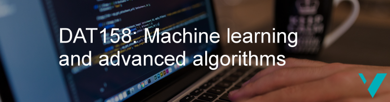

# Machine learning engineering

This is the repo of the machine learning part of the course _DAT158: Machine learning engineering and advanced algorithms_ at the [Western Norway University of Applied Sciences](https://www.hvl.no/en/studies-at-hvl/study-programmes/course/dat158), containing code and documentation for the programming parts of the course.

Course content is available at: [course website](https://skaliy.no/DAT158-ML-21/). Go to [Canvas](https://hvl.instructure.com/courses/17226) for additional course information.

### Course notebooks
The course is based on Jupyter Notebook, a web-based framework to write and present code-based projects.
Throughout the course you will work with notebooks containing various material and coding exercises, written by [Alexander Selvikvåg Lundervold] (https://alexander.lundervold.com/). _It is recommended to make copies of the course notebooks before editing_. You can follow the naming convention `my_[name_of_original_notebook].ipynb`.

To browse through the notebooks **interactively**, without having to install any software, you can use our Binder:

[ 
